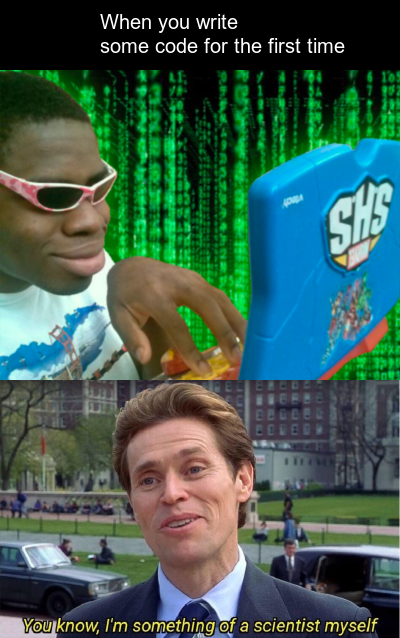

```{r setup, include=FALSE}
knitr::opts_chunk$set(echo = TRUE, error = FALSE, message = FALSE, warning = FALSE)
```

## My meme
I am a Computer Science major so I wanted my meme to be relevant to coding. The first image is from the movie hackerman, the image shows the person coding in a very sarcastic way. The second image has come from the movie spiderman where Norman Osborn says
"You know, I'm something of a scientist myself."


```{r file='meme.R', eval=FALSE}

```


## My animation 
I created this gif from combining several photos from the game Final Fantasy 7. The gif illustrates the battle between the two guys. The first frame is just of the character, second frame of him getting ready to unsheathe his sword, then unsheathing his sword, fighting and finally losing the battle. 

```{r file='animation.R', eval=FALSE}

```


## CSS for this website
```{css}
p {
font-weight: bold;
color: white;
}

img {
  border-radius: 8px;
  border: 5px solid white;
}

h1{
background-color: lightgrey;
padding: 15px;
border-radius: 20px;
}

h2{
text-decoration: underline;

}

body {
background-color: #24c5d4;
color: white;
font-family: Garamond, serif;
}

```


